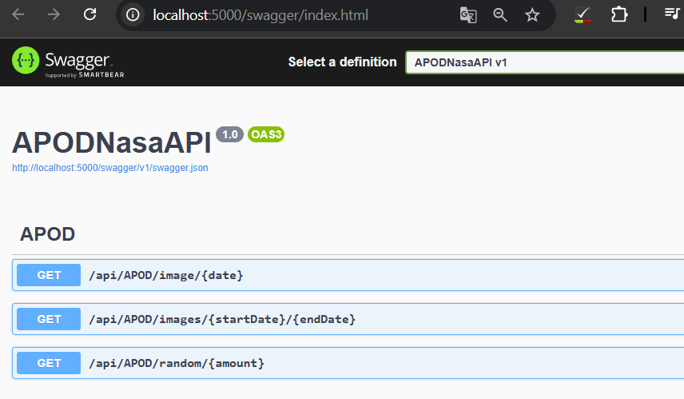
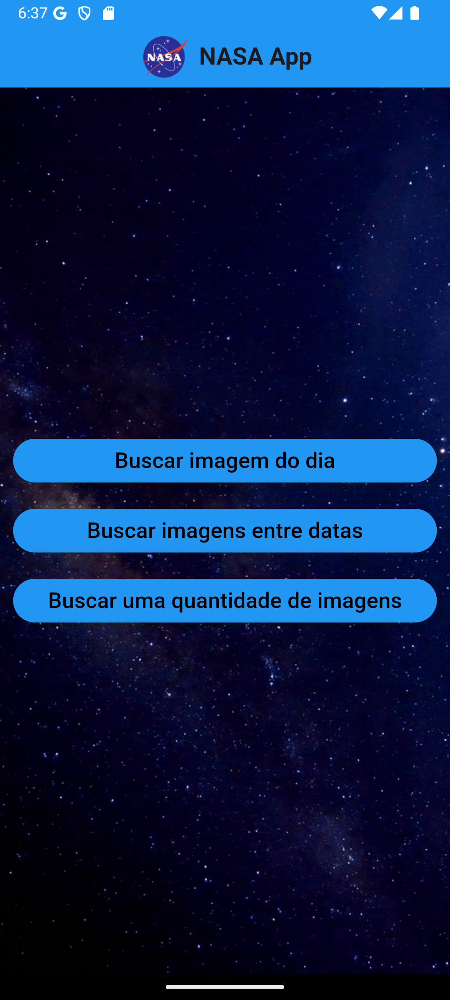
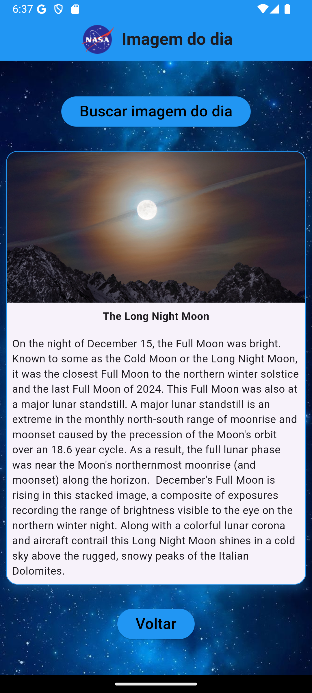
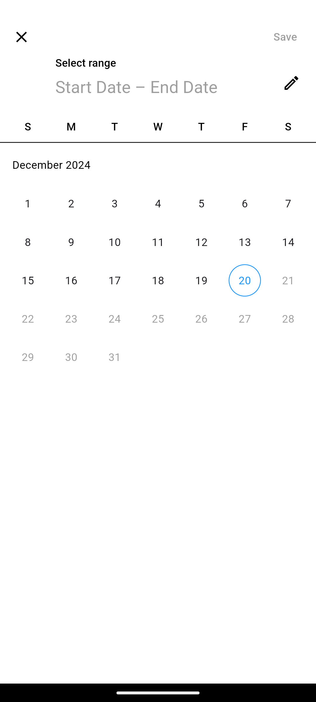
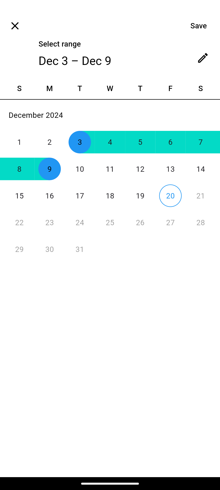
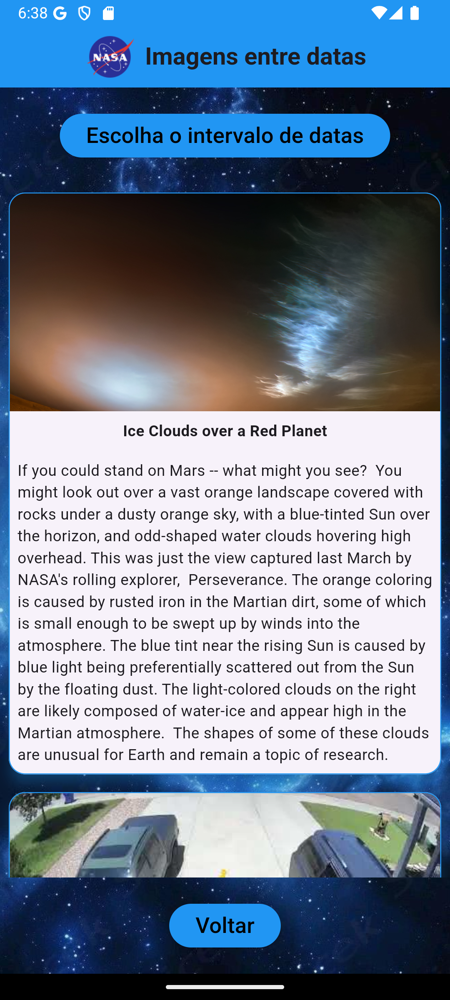
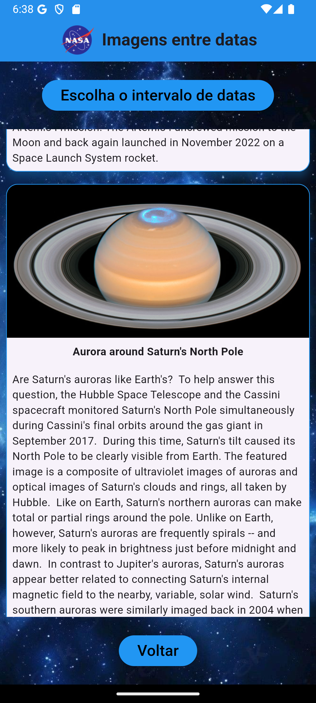
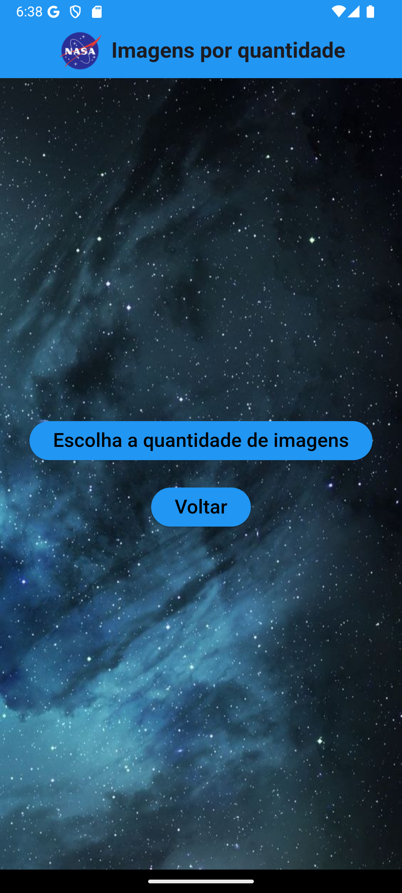
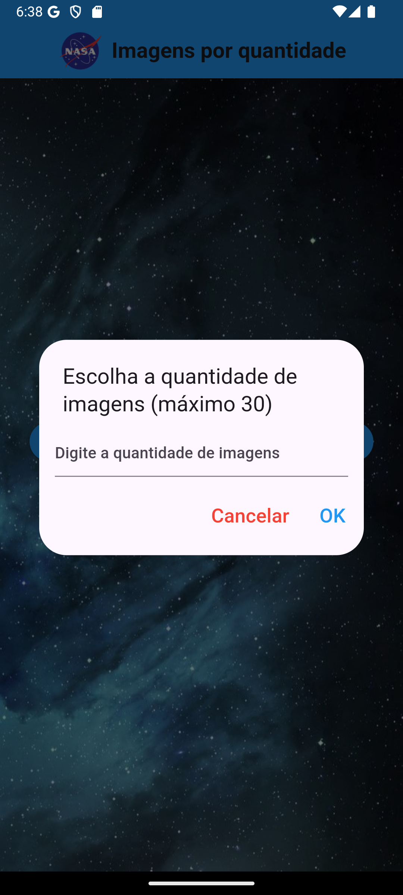
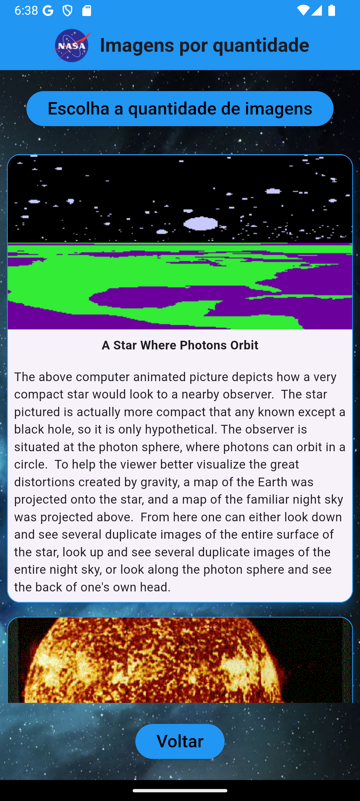

# APOD App

## Authors

- José Augusto Cenci Castilho
- Jadir Junior

## Description

Aplicativo em Flutter fazendo requisição em servidor C# ASP.Net Core. Requisição APOD Api.

## Setup Instructions

Não esqueça de utilizar o `flutter analyze` ou `flutter pub get` para instalar os componentes do Flutter.

Verificar o IP e colocar o seu localhost na pasta: `lib\model\apod.dart` -> Variável `baseUrl`.

## Screenshots

### API C# Swagger

### Home Page

### Imagem do Dia

### Imagens entre Datas

### Imagens por Quantidade

